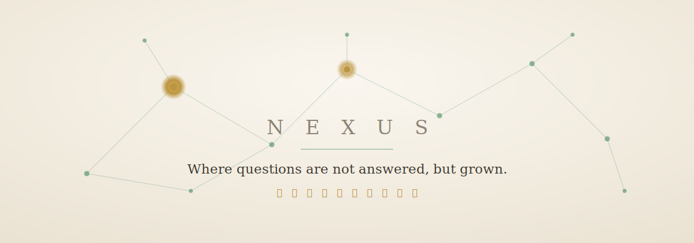

<div align="center">



<h3>Nexus</h3>

<p>問いを育てる観察環境 &nbsp;·&nbsp; <em>An environment for cultivating questions</em></p>

<p>
<a href="https://nexus-city.netlify.app/"><strong>▸ Open Nexus</strong></a>
&nbsp;·&nbsp; No account &nbsp;·&nbsp; Your data never leaves your device
</p>

</div>

---

> Most tools are built to help you find answers.
> **Nexus is built to keep your questions alive.**
>
> ほとんどの道具は、答えを見つけるためにある。
> **Nexus は、問いを生かしておくための場所だ。**

<br/>

## What is Nexus

A question is usually treated as a problem to be closed. Nexus treats it as something to be *grown*.

You plant a question. Over days and weeks you return to it, attach hypotheses, discoveries, and references, and connect it to other questions. Slowly, a structure forms — a private constellation of your own thinking. The value was never in any single note. It lives in the relationships **between** them.

問いは普通、閉じるべき課題として扱われる。Nexus は問いを、*育てるもの* として扱う。

一つの問いを置き、日をまたいで再訪し、仮説・発見・参照を結びつけ、他の問いとつなげていく。やがて構造が立ち上がる — あなただけの思考の星座が。価値は単一のノートにはない。ノートとノートの **あいだ** に宿る。

<br/>

## Six Principles · 六つの原理

|   | Principle | 原理 |
|---|-----------|------|
| **I** | A question is a beginning, not an end. | 問いは終着点ではなく起点である。 |
| **II** | Thought is a network, not a line. | 思考は線ではなくネットワークである。 |
| **III** | Discovery is born from revisiting, not new input. | 発見は入力ではなく再訪から生まれる。 |
| **IV** | Structure outlasts knowledge. | 構造は知識より長く残る。 |
| **V** | AI is an aid to observation, not an answering machine. | AIは回答者ではなく観察補助者である。 |
| **VI** | The self is discovered through observation. | 自己は観察によって発見される。 |

<br/>

## The Cycle · 循環

<div align="center">
<p><strong>Observe → Question → Explore → Discover → Structure → Overview → Observe again</strong></p>
<p>観察 → 問い → 探求 → 発見 → 構造化 → 俯瞰 → 新しい観察 …</p>
<p><em>This loop has no end.</em> &nbsp;—&nbsp; この循環に終わりはない。</p>
</div>

<br/>

## Features

- **Six kinds of notes** — Question, Hypothesis, Discovery, Conclusion, Reference, Journal. Each plays a distinct role in how a question matures.
- **A graph, not a list** — notes are nodes, relationships are edges. Meaning emerges from connection.
- **Discovery engines** — deterministic suggestions surface overlooked relationships. They never decide for you; every conclusion remains yours.
- **Quiet by design** — a calm *paper* theme and an *observatory* night theme, with adjustable type and size.
- **Everywhere** — one layout that adapts from phone to desktop.

<br/>

## Your data stays yours

Nexus is **local-first**. There is no account, no server, and no tracking. Everything you write is stored only in your own browser. You can **export a full backup to JSON** at any time, and **restore it** on another device — you carry your thinking with you, and no one else can read it.

Nexus は **ローカルファースト**。アカウントもサーバーも追跡もない。書いたものはすべて、あなたのブラウザの中だけに保存される。いつでも **JSONで完全バックアップを書き出し**、別の端末で **復元** できる。

<br/>

## Built simply

A single self-contained `index.html`. React loaded straight from a CDN and compiled in the browser — **no build step, no install**. Open the file and it runs.

```
React · esm.sh · localStorage · one HTML file
```

### Run it locally

```bash
git clone https://github.com/ZZz10120zZZ/Nexus.git
cd Nexus
open index.html        # or just double-click the file
```

<br/>

---

<div align="center">
<p><em>A place not to collect questions, but to cultivate them.</em></p>
<p>問いを集める場所ではなく、問いを育てる場所。</p>
<p><a href="https://nexus-city.netlify.app/"><strong>nexus-city.netlify.app</strong></a></p>
</div>
